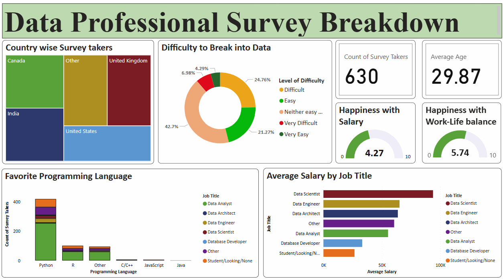

# Data Professional Survey Power BI Dashboard

## Project Overview
This Power BI dashboard presents a detailed analysis of a survey conducted among **data professionals** across various job titles and countries. It highlights insights about their salaries, programming preferences, work-life balance, and challenges breaking into the field.

## Objective
To explore trends in the data profession and help stakeholders:
- Understand how salary varies across job roles
- Identify the most popular programming languages
- Analyze regional participation in the data industry
- Assess challenges faced when entering data roles
- Measure satisfaction with work-life balance

## Key Features
- **Demographics & Count Cards**: Total survey participants (630), average age (29.87)
- **Country-wise Participation**: Treemap showing survey distribution
- **Difficulty to Break Into Data**: Donut chart categorized by perceived difficulty
- **Happiness with Work-Life Balance**: KPI gauge (avg score: 5.74/10)
- **Favorite Programming Languages**: Stacked column chart by job title
- **Average Salary by Job Title**: Horizontal bar chart comparing salary distributions

## Insights Derived
- Python is the most preferred programming language among data professionals
- Data Scientists report the highest average salary
- Many respondents find it moderately difficult to break into the field
- Work-life balance averages around 5.7/10, suggesting room for improvement

## Tools & Skills
- Power BI Desktop
- Power Query for data transformation
- Data Modeling (star schema)
- Visualization best practices

## What I Learned
- Creating survey dashboards with a balance of visual appeal and clarity
- Presenting categorical insights alongside numerical KPIs
- Designing with accessibility in mind using clear legends and labels

## Data Source
Synthetic or anonymized survey data collected from data professionals across roles such as:
- Data Scientist
- Data Engineer
- Data Analyst
- Database Developer
- Student / Job Seekers

---

## Connect With Me

For more projects and updates, feel free to visit my profiles:

- GitHub: [Keerthi's GitHub Profile](https://github.com/Keerthikadiyala91)  
- LinkedIn: [Keerthi's LinkedIn Profile](https://www.linkedin.com/in/keerthi-k-47868154/)