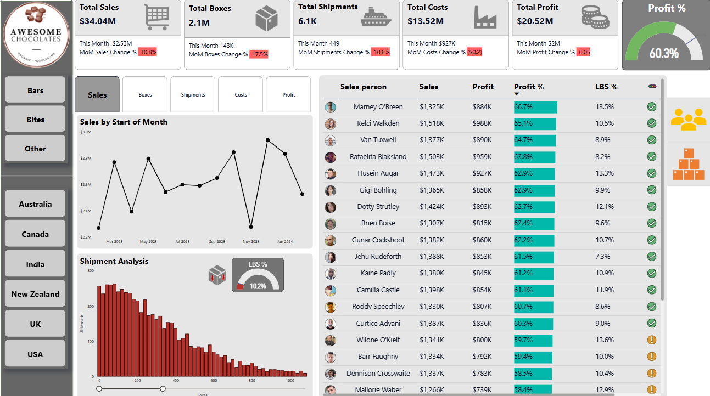

# 🍫 Awesome Chocolates Power BI Dashboard

## 📌 Project Overview
This project presents a comprehensive Power BI dashboard developed for **Awesome Chocolates**, visualizing key business performance metrics including sales, costs, profit, and shipments across various regions and product categories.

## 🎯 Objective
To track and analyze monthly business performance and enable decision-makers to:
- Monitor KPIs like Total Sales, Profit %, and MoM/YoY changes
- Evaluate salesperson-level contributions and profit margins
- Analyze shipment trends and box volumes
- Slice insights by Product Type and Country

## Key Features
- **KPI Cards**: Total Sales ($34.04M), Profit ($20.52M), Shipments (6.1K), and Costs ($13.52M) with MoM comparisons
- **Region and Product Filters**: Quick filtering by country/product type
- **Time Series Line Chart**: Monthly sales trends
- **Shipment Histogram**: Shipment volume by size
- **Salesperson Table**:
  - Sales, Profit %, LBS % with data bars
  - Conditional formatting for top/bottom performance
- **Calendar Table**: Enables MoM, YoY, and YTD analysis

## DAX Highlights
Used DAX functions to compute:
- MoM Sales Change %
- YoY Sales Change %
- Profit %
- Total Sales for Current and Previous Year (YTD)
  
Functions used: `VAR`, `CALCULATE`, `DATESYTD`, `SAMEPERIODLASTYEAR`, `DIVIDE`

## Tools & Skills
- Power BI Desktop
- DAX (Data Analysis Expressions)
- Data Modeling (Star Schema)
- Power Query for cleaning and calendar generation

## What I Learned
- Creating time-intelligent KPIs
- Building slicer-friendly dashboards
- Writing optimized DAX with variables

## Data Source
Synthetic chocolate sales and shipment data modeled in a star schema:
- Fact: Shipments
- Dimensions: Products, People, Calendar, Locations

---

## Connect With Me

For more projects and updates, feel free to visit my profiles:

- GitHub: [Keerthi's GitHub Profile](https://github.com/Keerthikadiyala91)  
- LinkedIn: [Keerthi's LinkedIn Profile](https://www.linkedin.com/in/keerthi-k-47868154/)
